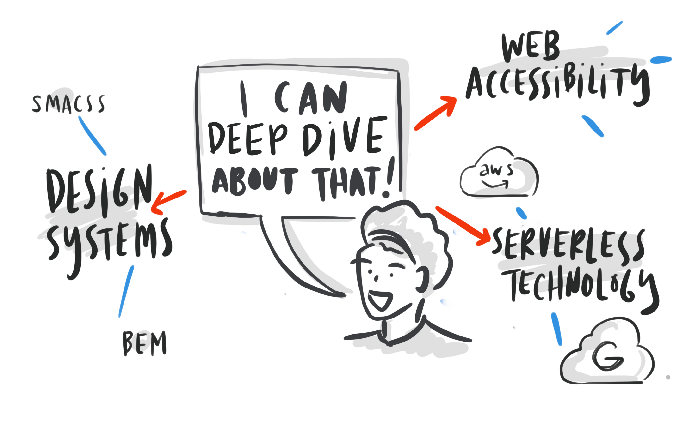

## These Are The Things That Will Give You An Edge

- Design Systems

A Design System is a set of interconnected patterns and shared practices coherently organized to aid in digital product design and development of products such as apps or websites.
- Web Accessibility

Web accessibility refers to the accessibility of a computer system to all people, regardless of disability type or severity of impairment.

- Usage of APIS

 that is, Application Programming Interfaces — play a bigger role in today's economy than ever before. They allow us to share important data and expose practical business functionality between devices, applications, and individuals

- Understanding At Least Serverless Technology ( AWS, Google Cloud)

Serverless computing is a cloud computing execution model in which the cloud provider runs the server, and dynamically manages the allocation of machine resources. Pricing is based on the actual amount of resources consumed by an application, rather than on pre-purchased units of capacity

